---
## Front matter
title: "Отчёт по лабораторной работе 2"
subtitle: "Архитектура компьютеров и операционные системы"
author: "Дрожжанова А.Д. НБИбд-01-23"

## Generic otions
lang: ru-RU
toc-title: "Содержание"

## Bibliography
bibliography: bib/cite.bib
csl: pandoc/csl/gost-r-7-0-5-2008-numeric.csl

## Pdf output format
toc: true # Table of contents
toc-depth: 2
lof: true # List of figures
lot: true # List of tables
fontsize: 12pt
linestretch: 1.5
papersize: a4
documentclass: scrreprt
## I18n polyglossia
polyglossia-lang:
  name: russian
  options:
	- spelling=modern
	- babelshorthands=true
polyglossia-otherlangs:
  name: english
## I18n babel
babel-lang: russian
babel-otherlangs: english
## Fonts
mainfont: PT Serif
romanfont: PT Serif
sansfont: PT Sans
monofont: PT Mono
mainfontoptions: Ligatures=TeX
romanfontoptions: Ligatures=TeX
sansfontoptions: Ligatures=TeX,Scale=MatchLowercase
monofontoptions: Scale=MatchLowercase,Scale=0.9
## Biblatex
biblatex: true
biblio-style: "gost-numeric"
biblatexoptions:
  - parentracker=true
  - backend=biber
  - hyperref=auto
  - language=auto
  - autolang=other*
  - citestyle=gost-numeric
## Pandoc-crossref LaTeX customization
figureTitle: "Рис."
tableTitle: "Таблица"
listingTitle: "Листинг"
lofTitle: "Список иллюстраций"
lotTitle: "Список таблиц"
lolTitle: "Листинги"
## Misc options
indent: true
header-includes:
  - \usepackage{indentfirst}
  - \usepackage{float} # keep figures where there are in the text
  - \floatplacement{figure}{H} # keep figures where there are in the text
---

# Цель работы

Изучить идеологию и применение средств контроля версий. Приобрести практические навыки по работе с системой git.

# Задания

1.	Настройка github

2.	Базовая настройка git

3.	Создание SSH ключа

4.	Создание рабочего пространства и репозитория курса на основе шаблона

5.	Создание репозитория курса на основе шаблона

6.	Настройка каталога курса

7.	Задание для самостоятельной работы

# Теоретическое введение

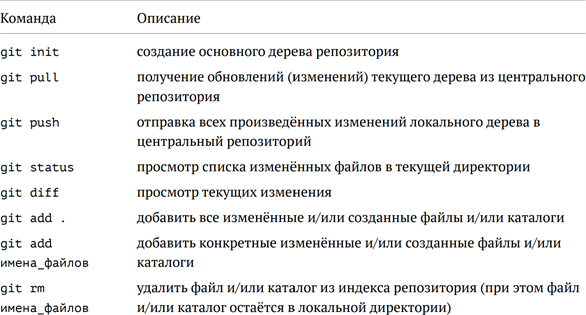{ #fig:001 width=70%, height=70% }

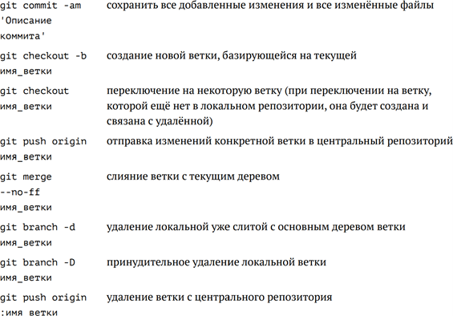{ #fig:002 width=70%, height=70% }

# Выполнение лабораторной работы

1. Создала учётную запись на сайте https://github.com/ и заполнила основные данные.

2.	Сделаю предварительную конфигурацию git. Открываю терминал и ввожу следующие команды, указав имя и email владельца репозитория.

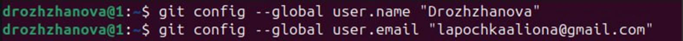{ #fig:003 width=70%, height=70% }

3.	Настроиваю utf-8 в выводе сообщений git, задала имя начальной ветки (будем называть её master), параметр autocrlf и параметр safecrlf.

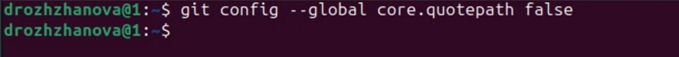{ #fig:004 width=70%, height=70% }

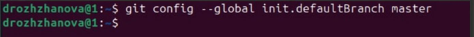{ #fig:005 width=70%, height=70% }

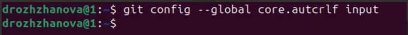{ #fig:006 width=70%, height=70% }

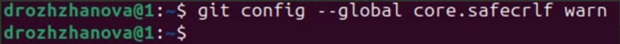{ #fig:007 width=70%, height=70% }

4.	Для последующей идентификации пользователя на сервере репозиториев генерирую пару ключей, далее загружаю сгенерированный открытый ключ, копирую из локальной консоли ключ в буфер обмена.

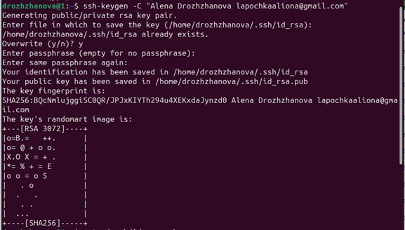{ #fig:008 width=70%, height=70% }

5.	Вставляю ключ в появившееся на сайте поле и указываем для ключа имя.

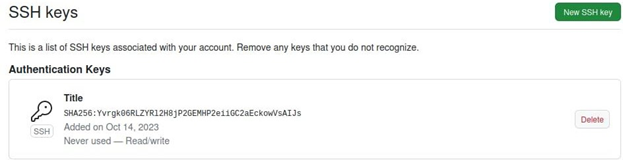{ #fig:009 width=70%, height=70% }

6.	Открываю терминал и создаю каталог для предмета «Архитектура компьютера».

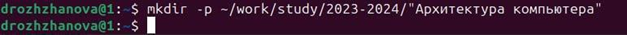{ #fig:010 width=70%, height=70% }

7.	Создаю репозиторий на основе шаблона через web-интерфейс githab и даю ему имя

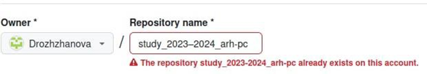{ #fig:011 width=70%, height=70% }

8.	Открываю терминал и перехожу в каталог курса.

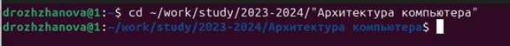{ #fig:012 width=70%, height=70% }

9.	Клонирую созданный репозиторий.

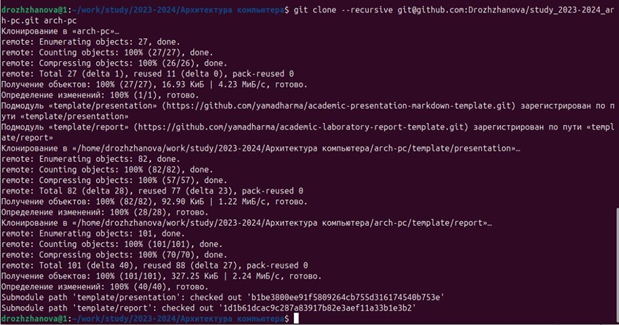{ #fig:013 width=70%, height=70% }

10.	Перехожу в каталог курса и удаляю лишние файлы.

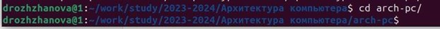{ #fig:014 width=70%, height=70% }

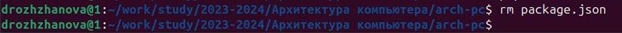{ #fig:015 width=70%, height=70% }

11.	Создаю необходимые каталоги и отправляю файлы на сервер.

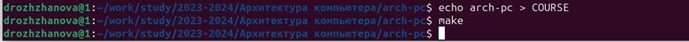{ #fig:016 width=70%, height=70% }

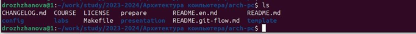{ #fig:017 width=70%, height=70% }

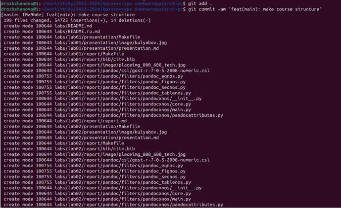{ #fig:018 width=70%, height=70% }

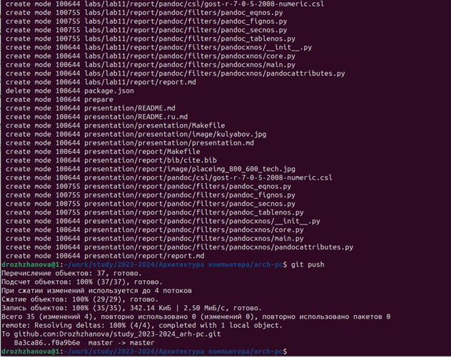{ #fig:019 width=70%, height=70% }

12.	Проверяю правильность создания иерархии рабочего пространства в локальном репозитории и на странице github.

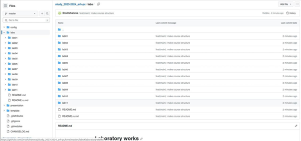{ #fig:020 width=70%, height=70% }

## Выполнение заданий для самостоятельной работы

1. Перехожу в директорию labs/lab02/report с помощью утилиты cd. Создаю в каталоге файл для отчёта второй лабораторной работы с помощью утилиты touch

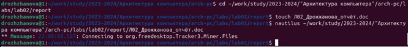{ #fig:021 width=70%, height=70% }

2. Проверяю скопировалась ли первая лабораторная работа

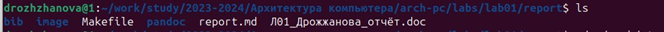{ #fig:022 width=70%, height=70% }

3. Перехожу в каталог arch-pc, чтобы отправить все добавленные файлы в репозиторий. Использую команды git add, git commit -m «Add existing files» и git push.

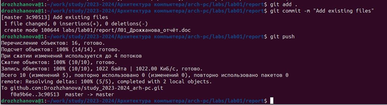{ #fig:023 width=70%, height=70% }

4. Проверяю выполнение работы на сайте github

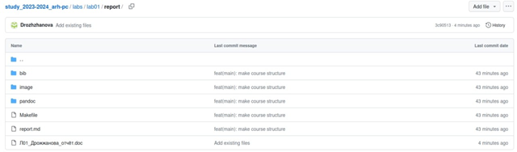{ #fig:024 width=70%, height=70% }

# Выводы

В заключение хочу отметить, что я изучила идеологию и применение средств контроля версий. Также приобрела практические навыки по работе с системой github.

# Источники

1. Архитектура ЭВМ - Материалы курса
