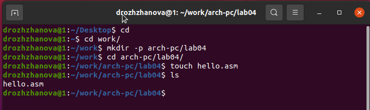
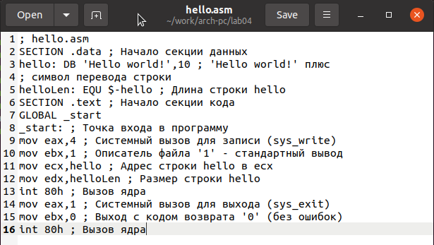
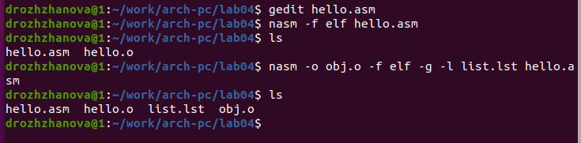
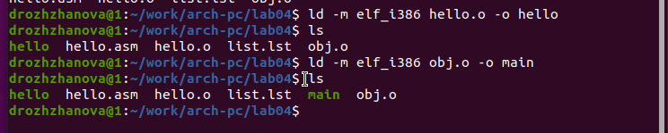
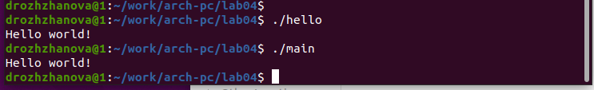
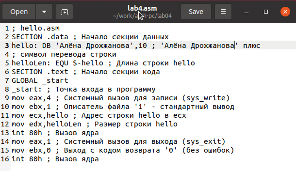
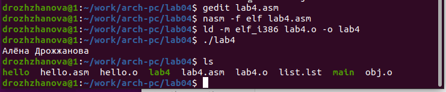

---
## Front matter
title: "Отчёт по лабораторной работе 4"
subtitle: "Архитектура компьютеров и операционные системы"
author: "Дрожжанова А.Д. НБИбд-01-23"

## Generic otions
lang: ru-RU
toc-title: "Содержание"

## Bibliography
bibliography: bib/cite.bib
csl: pandoc/csl/gost-r-7-0-5-2008-numeric.csl

## Pdf output format
toc: true # Table of contents
toc-depth: 2
lof: true # List of figures
lot: true # List of tables
fontsize: 12pt
linestretch: 1.5
papersize: a4
documentclass: scrreprt
## I18n polyglossia
polyglossia-lang:
  name: russian
  options:
	- spelling=modern
	- babelshorthands=true
polyglossia-otherlangs:
  name: english
## I18n babel
babel-lang: russian
babel-otherlangs: english
## Fonts
mainfont: PT Serif
romanfont: PT Serif
sansfont: PT Sans
monofont: PT Mono
mainfontoptions: Ligatures=TeX
romanfontoptions: Ligatures=TeX
sansfontoptions: Ligatures=TeX,Scale=MatchLowercase
monofontoptions: Scale=MatchLowercase,Scale=0.9
## Biblatex
biblatex: true
biblio-style: "gost-numeric"
biblatexoptions:
  - parentracker=true
  - backend=biber
  - hyperref=auto
  - language=auto
  - autolang=other*
  - citestyle=gost-numeric
## Pandoc-crossref LaTeX customization
figureTitle: "Рис."
tableTitle: "Таблица"
listingTitle: "Листинг"
lofTitle: "Список иллюстраций"
lotTitle: "Список таблиц"
lolTitle: "Листинги"
## Misc options
indent: true
header-includes:
  - \usepackage{indentfirst}
  - \usepackage{float} # keep figures where there are in the text
  - \floatplacement{figure}{H} # keep figures where there are in the text
---

# Цель работы

Целью работы является освоение процедуры компиляции и сборки программ, написанных на ассемблере NASM.

# Задания

1. Изучить основы языка Ассемблера

2. Изучить и рассмотреть на практике процесс сборки программы

3. Выполнить задание по программе

4. Подготовить отчет и загрузить на GitHub

# Теоретическое введение

Язык ассемблера (assembly language, сокращённо asm) — машинно-ориентированный
язык низкого уровня. Можно считать, что он больше любых других языков приближен к
архитектуре ЭВМ и её аппаратным возможностям, что позволяет получить к ним более
полный доступ, нежели в языках высокого уровня,таких как C/C++, Perl, Python и пр. Заметим,
что получить полный доступ к ресурсам компьютера в современных архитектурах нельзя,
самым низким уровнем работы прикладной программы является обращение напрямую к
ядру операционной системы. Именно на этом уровне и работают программы, написанные
на ассемблере. Но в отличие от языков высокого уровня ассемблерная программа содержит
только тот код, который ввёл программист. Таким образом язык ассемблера — это язык, с
помощью которого понятным для человека образом пишутся команды для процессора.

Следует отметить, что процессор понимает не команды ассемблера, а последовательности
из нулей и единиц — машинные коды. До появления языков ассемблера программистам
приходилось писать программы, используя только лишь машинные коды, которые были
крайне сложны для запоминания, так как представляли собой числа, записанные в двоичной
или шестнадцатеричной системе счисления. Преобразование или трансляция команд с языка ассемблера в исполняемый машинный код осуществляется специальной программой
транслятором — Ассемблер

Программы, написанные на языке ассемблера, не уступают в качестве и скорости программам, написанным на машинном языке,так как транслятор просто переводит мнемонические
обозначения команд в последовательности бит (нулей и единиц).

В нашем курсе будет использоваться ассемблер NASM (Netwide Assembler).
NASM — это открытый проект ассемблера, версии которого доступны под различные
операционные системы и который позволяет получать объектные файлы для этих систем. В
NASM используется Intel-синтаксис и поддерживаются инструкции x86-64.
Типичный формат записи команд NASM имеет вид: 

```[метка:] мнемокод [операнд {, операнд}] [; комментарий]```

Здесь мнемокод— непосредственно мнемоника инструкции процессору, которая является
обязательной частью команды. Операндами могут быть числа,данные, адреса регистров или
адреса оперативной памяти. Метка — это идентификатор, с которым ассемблер ассоциирует
некоторое число, чаще всего адрес в памяти. Т.о. метка перед командой связана с адресом
данной команды.


# Выполнение лабораторной работы

1. Создала каталог lab04 командой mkdir, перешла в него с помощью команды cd, создала файл hello.asm.

{ #fig:001 width=70%, height=70% }

2. Открыла файл в gedit и написала код программы по заданию.

{ #fig:002 width=70%, height=70% }

```
; hello.asm
SECTION .data ; Начало секции данных
hello: DB 'Hello world!',10 ; 'Hello world!' плюс
; символ перевода строки
helloLen: EQU $-hello ; Длина строки hello
SECTION .text ; Начало секции кода
GLOBAL _start
_start: ; Точка входа в программу
mov eax,4 ; Системный вызов для записи (sys_write)
mov ebx,1 ; Описатель файла '1' - стандартный вывод
mov ecx,hello ; Адрес строки hello в ecx
mov edx,helloLen ; Размер строки hello
int 80h ; Вызов ядра
mov eax,1 ; Системный вызов для выхода (sys_exit)
mov ebx,0 ; Выход с кодом возврата '0' (без ошибок)
int 80h ; Вызов ядра
```
3. Транслировала файл командой nasm c опцией -f. Ключ -f указывает транслятору, что требуется создать
бинарные файлы в формате ELF. 

Получился объектный файл hello.o

4. Транслировала файл командой nasm с дополнительными опциями : -o, -g, -l
Опция -o позволяет задать имя объектного файла. 
Опция -g добавляет отладочную информацию. 
Опция -l создает файл листинг. 

Получился файл листинга list.lst, объектный файл obj.o, в программу добавилась отладочная информация.

{ #fig:003 width=70%, height=70% }

5. Выполнила компановку командой ld и получила исполняемый файл.

6. Еще раз выполнила компановку для объектного файла obj.o и получила исполняемый файл main.

{ #fig:004 width=70%, height=70% }

7. Запустила исполняемые файлы.

{ #fig:005 width=70%, height=70% }

## Выполнение заданий для самостоятельной работы.

1. Скопировала программу в файл lab4.asm.

{ #fig:006 width=70%, height=70% }

2. Изменила сообщение Hello world на свое имя.

{ #fig:007 width=70%, height=70% }

3. Оттранслировала полученный текст программы lab4.asm в объектный файл. Выполнила
компоновку объектного файла и запустила получившийся исполняемый файл.

{ #fig:008 width=70%, height=70% }

4. Загрузила файлы на github.

# Выводы

Освоили процесс компиляции и сборки программ, написанных на ассемблере nasm.

# Источники

1. Архитектура ЭВМ - Материалы курса
