---
## Front matter
title: "Отчёт по лабораторной работе 5"
subtitle: Архитектура компьютеров и операционные системы"
author: "Дрожжанова А.Д. НБИбд-01-23"

## Generic otions
lang: ru-RU
toc-title: "Содержание"

## Bibliography
bibliography: bib/cite.bib
csl: pandoc/csl/gost-r-7-0-5-2008-numeric.csl

## Pdf output format
toc: true # Table of contents
toc-depth: 2
lof: true # List of figures
lot: true # List of tables
fontsize: 12pt
linestretch: 1.5
papersize: a4
documentclass: scrreprt
## I18n polyglossia
polyglossia-lang:
  name: russian
  options:
	- spelling=modern
	- babelshorthands=true
polyglossia-otherlangs:
  name: english
## I18n babel
babel-lang: russian
babel-otherlangs: english
## Fonts
mainfont: PT Serif
romanfont: PT Serif
sansfont: PT Sans
monofont: PT Mono
mainfontoptions: Ligatures=TeX
romanfontoptions: Ligatures=TeX
sansfontoptions: Ligatures=TeX,Scale=MatchLowercase
monofontoptions: Scale=MatchLowercase,Scale=0.9
## Biblatex
biblatex: true
biblio-style: "gost-numeric"
biblatexoptions:
  - parentracker=true
  - backend=biber
  - hyperref=auto
  - language=auto
  - autolang=other*
  - citestyle=gost-numeric
## Pandoc-crossref LaTeX customization
figureTitle: "Рис."
tableTitle: "Таблица"
listingTitle: "Листинг"
lofTitle: "Список иллюстраций"
lotTitle: "Список таблиц"
lolTitle: "Листинги"
## Misc options
indent: true
header-includes:
  - \usepackage{indentfirst}
  - \usepackage{float} # keep figures where there are in the text
  - \floatplacement{figure}{H} # keep figures where there are in the text
---

# Цель работы

Целью работы является приобретение практических навыков работы в Midnight Commander. 
Освоение инструкций языка ассемблера mov и int.

# Задания

1. Освоить возможности Midnight Commander

2. Изучить примеры программ с использованием внешнего файла in_out.asm

3. Выполнить задание по программе

4. Подготовить отчет и загрузить на GitHub

# Теоретическое введение

Midnight Commander (или просто mc) — это программа, которая позволяет просматривать
структуру каталогов и выполнять основные операции по управлению файловой системой,
т.е. mc является файловым менеджером. Midnight Commander позволяет сделать работу с
файлами более удобной и наглядной.

Программа на языке ассемблера NASM, как правило, состоит из трёх секций: секция кода
программы (SECTION .text), секция инициированных (известных во время компиляции)
данных (SECTION .data) и секция неинициализированных данных (тех, под которые во
время компиляции только отводится память, а значение присваивается в ходе выполнения
программы) (SECTION .bss).

Инструкция языка ассемблера mov предназначена для дублирования данных источника в
приёмнике. В общем виде эта инструкция записывается в виде mov dst,src
Здесь операнд dst — приёмник, а src — источник

Инструкция языка ассемблера int предназначена для вызова прерывания с указанным
номером. В общем виде она записывается в виде int n
Здесь n — номер прерывания, принадлежащий диапазону 0–255

# Выполнение лабораторной работы

1. Открыла Midnight Commander, с помощью клавишь со стрелками и Enter перехожу в каталог ~/work/arch-pc.
Далее нажимаю F7 и создаю каталог lab05

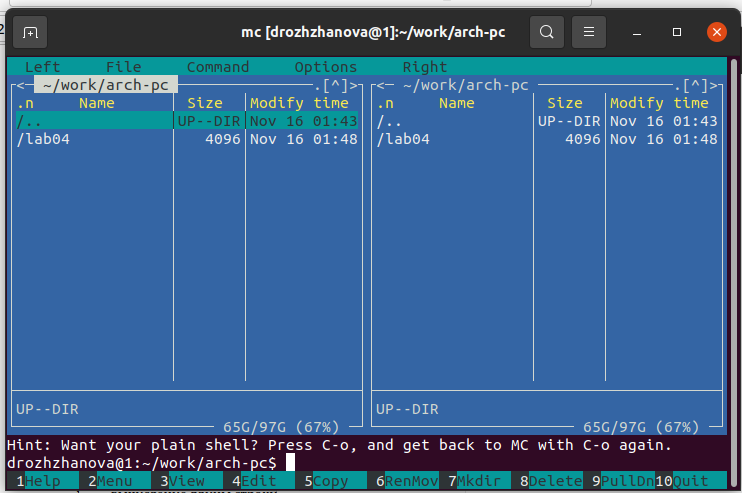{ #fig:001 width=70%, height=70% }

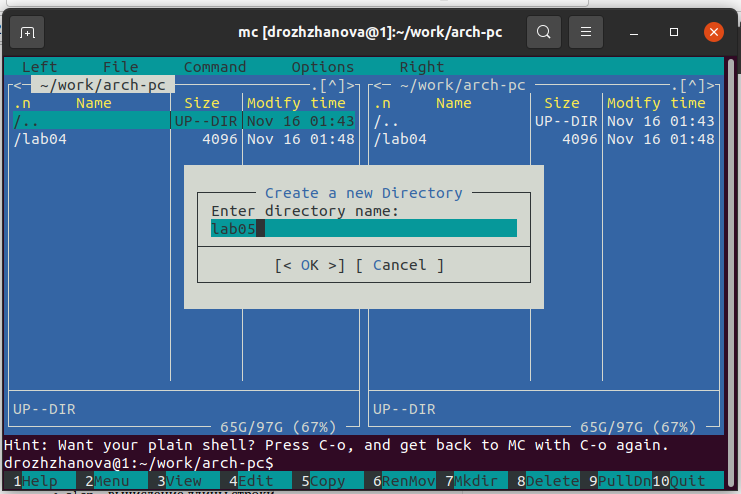{ #fig:002 width=70%, height=70% }

2. При помощи touch создала файл lab05-1.asm

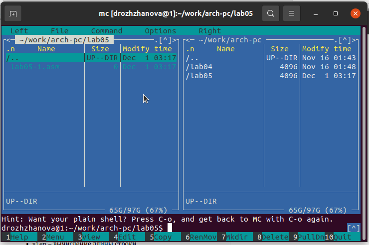{ #fig:003 width=70%, height=70% }

3. Открыла файл на редактирование клавишей F4, выбрала редактор mceditor, 
написала код программы из задания.

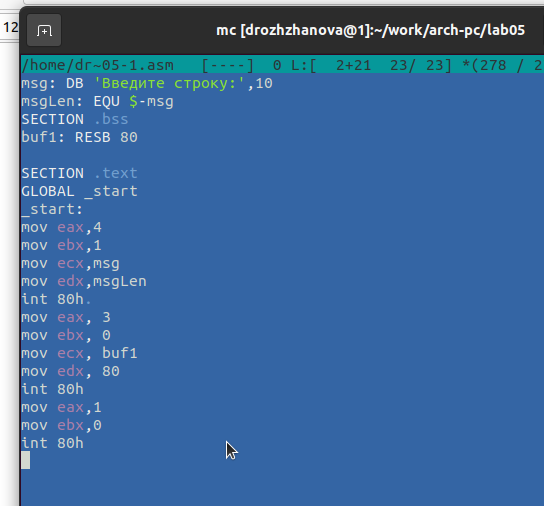{ #fig:004 width=70%, height=70% }

4. Открыла файл на просмотр клавишей F3 и проверила, что он содержит набранный код.

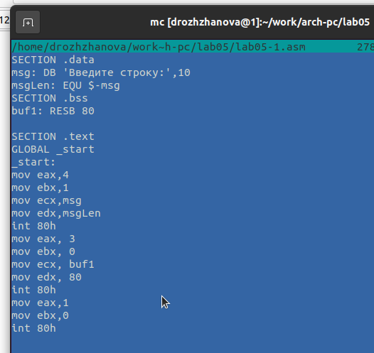{ #fig:005 width=70%, height=70% }

5. Транслировала файл программы в объектный файл, выполнила компановку объектного файла, 
получила исполняемый файл программы и провреила ее работу.

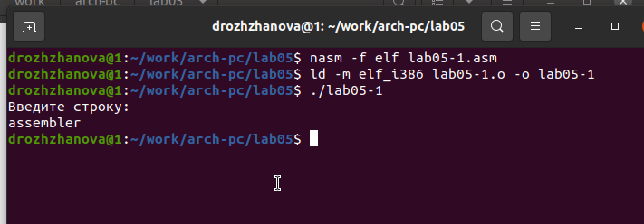{ #fig:006 width=70%, height=70% }

6. Для упрощения написания программ часто встречающиеся одинаковые участки кода
(такие как, например, вывод строки на экран или выход их программы) можно оформить
в виде подпрограмм и сохранить в отдельные файлы, а во всех нужных местах поставить
вызов нужной подпрограммы. Это позволяет сделать основную программу более удобной
для написания и чтения.

Скачала файл in_out.asm и разместила его в рабочем каталоге. 
Для копирования используется клавиша F5.
Для перемещения используется клавиша F6.

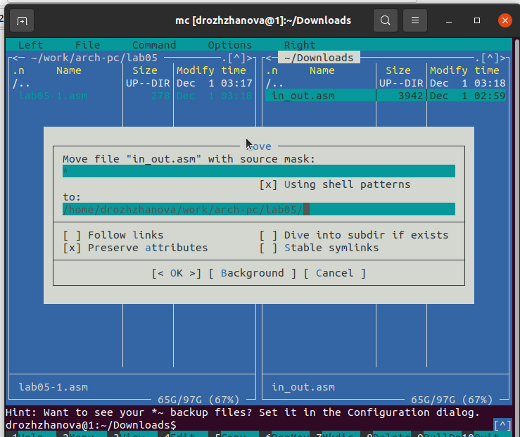{ #fig:007 width=70%, height=70% }

7. Скопировала lab05-1.asm в lab05-2.asm.

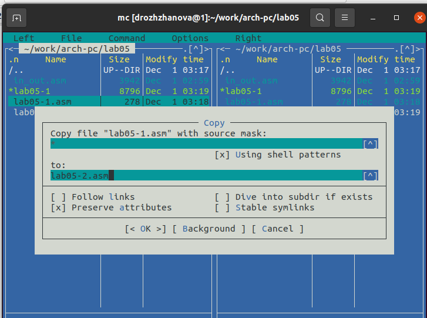{ #fig:008 width=70%, height=70% }

8. Написала код программы lab05-2.asm с использованием подпрограмм из
внешнего файла in_out.asm.

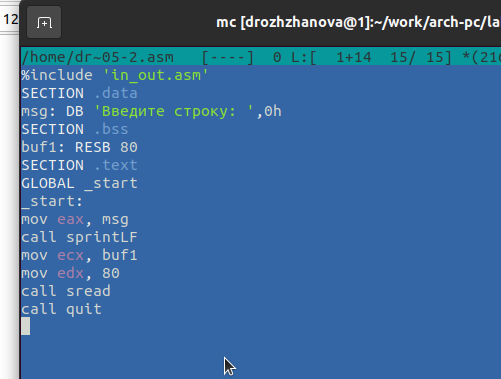{ #fig:009 width=70%, height=70% }

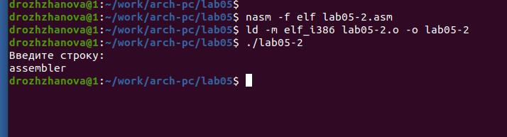{ #fig:010 width=70%, height=70% }

9. В файле lab5-2.asm заменила подпрограмму sprintLF на sprint. 
Заново собрала исполняеый файл. 
Теперь после вывода строки она не завершается символом перехода на новую строку.

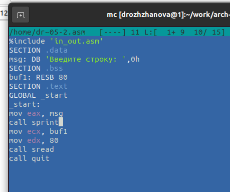{ #fig:011 width=70%, height=70% }

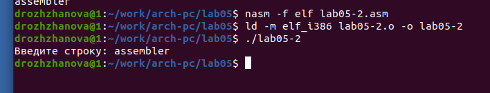{ #fig:012 width=70%, height=70% }

## Выполнение заданий для самостоятельной работы.

Скопировала программу lab05-1.asm и изменила код, так чтобы она работала по следующему алгоритму:

* вывести приглашение типа “Введите строку:”;

* ввести строку с клавиатуры;

* вывести введённую строку на экран.

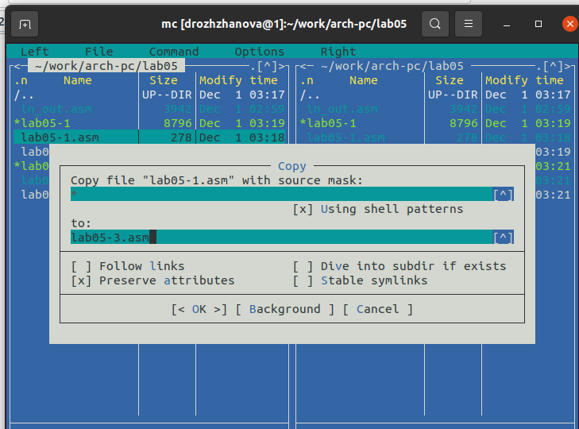{ #fig:013 width=70%, height=70% }

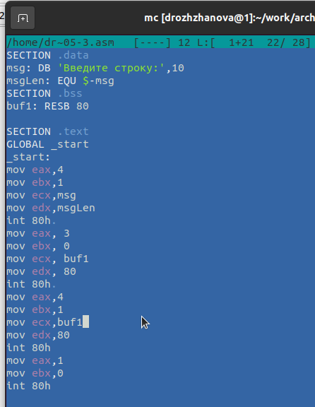{ #fig:014 width=70%, height=70% }

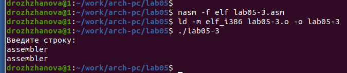{ #fig:015 width=70%, height=70% }

Аналогично скопировала программу lab05-2.asm и изменила код, но теперь использовал подпрограммы из файла in_out.asm.

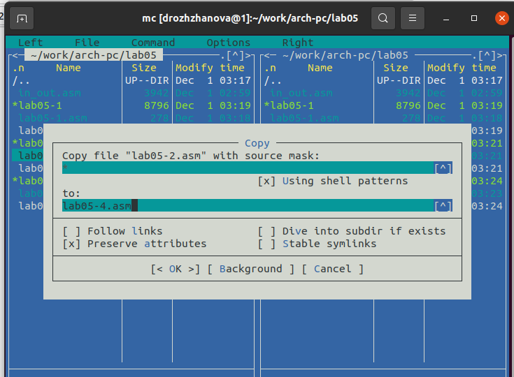{ #fig:016 width=70%, height=70% }

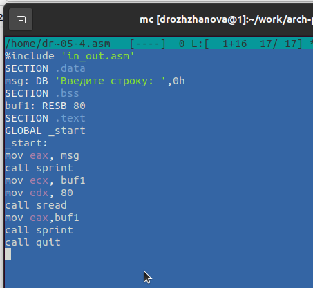{ #fig:017 width=70%, height=70% }

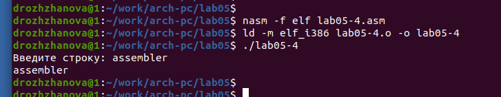{ #fig:018 width=70%, height=70% }

# Выводы

Научились писать базовые ассемблерные программы. Освоили ассемблерные инструкции mov и int.

# Источники

1. Архитектура ЭВМ - Материалы курса